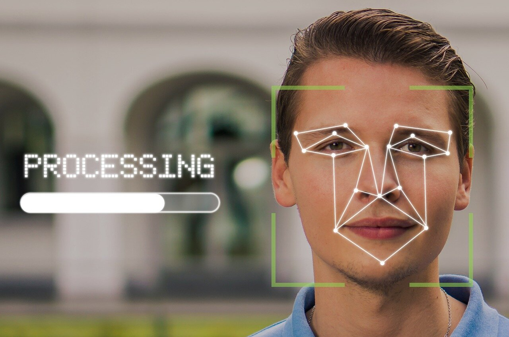
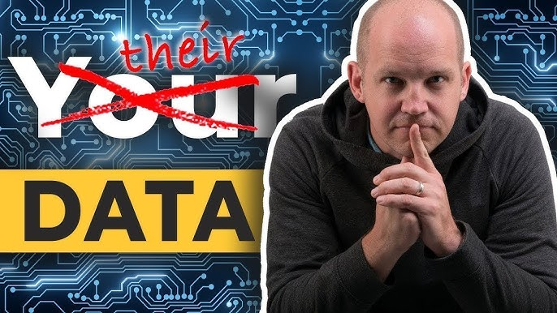

## Overview AI and Information Privacy

As AI technology continues to evolve, so will the legal and ethical challenges it presents. While AI offers immense benefits in fields like healthcare, finance, and customer service, it also raises complex questions about data privacy, security, and the rights of individuals. Businesses and policymakers alike need to work together to develop a comprehensive framework that protects individual privacy while allowing AI to flourish.

A particularly alarming example of this issue is the rise of AI-generated deepfakes, where machine learning is used to create hyper-realistic fake images or videos of individuals, often without their consent. **Popular actors and singers, such as Scarlett Johansson and Gal Gadot, have been victims of this technology, with AI-generated pornographic content featuring their likenesses being circulated online.** 

These deepfake images and videos are not only damaging to the reputation and privacy of these celebrities, but they also raise broader concerns about consent, misuse of personal data, and the psychological harm inflicted on victims.

The use of deepfake technology to manipulate video and audio for malicious purposes -- whether it's to stoke violence or defame politicians and journalists -- is becoming a real threat. As these tools become more accessible and their products more realistic, how will they shape what we believe about the world? In a portentous talk, law professor Danielle Citron reveals how deepfakes magnify our distrust -- and suggests approaches to safeguarding the truth. [This is an external link to Ted Talk](https://www.ted.com/talks/danielle_citron_how_deepfakes_undermine_truth_and_threaten_democracy?subtitle=en/) 

Deepfakes have made it frighteningly easy for bad actors to manipulate images and create explicit content, blurring the lines between reality and fabrication. This has led to calls for stricter legal regulations around the use of AI in generating such content. While some countries have enacted laws against non-consensual deepfake pornography, the global nature of the internet makes it difficult to enforce these laws consistently. This example starkly illustrates the risks posed by unchecked AI development and the urgent need for policies that govern the ethical use of such technologies.

One of the primary concerns surrounding AI is its reliance on vast amounts of personal data. The rise of AI in areas like facial recognition and surveillance technologies raises serious ethical concerns. While these tools can be beneficial for security purposes, they also pose threats to civil liberties if misused. The potential for mass surveillance without adequate checks and balances threatens individual freedoms and could erode trust in both governments and corporations.

An example that brings these concerns into the public eye involves **Taylor Swift and her use of facial recognition technology at one of her concerts. In 2018, Swift’s security team installed a facial recognition kiosk at her Rose Bowl concert to scan the faces of attendees. The system was reportedly used to identify potential stalkers from a database of known offenders.** 

While this may seem like a reasonable security measure, it raises significant legal and privacy questions: Did attendees consent to having their faces scanned? Who has access to the data collected? How is it stored and used after the event?

AI systems often require significant data inputs to function effectively, including sensitive information such as medical records, financial transactions, and behavioral patterns. Without proper safeguards, the collection, storage, and processing of such data can lead to privacy breaches or misuse. The GDPR in Europe, the California Consumer Privacy Act (CCPA), and other emerging global regulations have already set standards for data protection, but AI's capacity to infer new information from datasets makes even anonymized data vulnerable.

Beyond privacy concerns, the use of AI in decision-making introduces issues of transparency and accountability. When AI is used to make decisions about employment, credit approval, or legal sentencing, the opacity of machine learning algorithms—often referred to as "black-box AI"—can make it difficult to understand how certain conclusions are reached. This lack of transparency can make it harder for individuals to challenge decisions, potentially leading to biased or discriminatory outcomes. Policymakers must address how to ensure fairness and accountability in these systems, potentially by requiring more explainable AI (XAI) solutions.

Finally, AI's role in autonomous systems—such as self-driving cars and drones—highlights the need for new legal frameworks to assign liability. If an AI-powered vehicle causes an accident, for example, determining who is responsible—whether it's the manufacturer, the software developer, or the user—becomes a complicated legal question. As AI systems become more autonomous, legal systems will need to evolve to handle these novel issues of liability and accountability.

To address these challenges, a multi-stakeholder approach is essential. Governments must collaborate with technology companies, legal experts, and civil society to establish clear regulations that balance innovation with ethical considerations. This will involve not only creating robust data protection laws but also fostering an ecosystem of trust around AI technology by promoting transparency, fairness, and accountability.

The potential of AI is vast, but so are the risks associated with it. By developing a framework that emphasizes responsible AI development and addresses privacy, security, and legal issues head-on, we can ensure that AI continues to evolve in a way that benefits society while safeguarding individual rights.

Any potential framework shoould includes following"

### Who Owns Your Data?

AI systems need a lot of data to work well. This data can include personal details like your browsing history, purchase records, and even facial recognition data. This raises important questions: Who owns this data? Is it the person it describes, the company that collects it, or the AI system that uses it? Clear ownership rules are essential to make sure people have control over their personal information.

[Few interesting case studies are in this video](https://www.youtube.com/watch?v=q86RKI-uZSc)

### Who Owns the AI Model

Once an AI system is trained on this data, another question comes up: who owns the AI model? Is it owned by the company that developed and trained it, or do the individuals whose data was used have some claim? This question of ownership is crucial for understanding who controls the AI's behavior and performance.

Understanding data ownership goes beyond simply storing data on different servers. It's about distinguishing between the data used to train the AI and the AI's learned behavior and performance. This difference helps make sure that peoples' personal information is protected while also clarifying who owns and controls the AI systems and their outputs.

### Data Transparency

How much do you know about how AI uses your data? Many AI algorithms are complex and are difficult to understand. This lack of transparency makes it hard for individuals to know how their data is being used and whether it's being used responsibly.

### Data Security

With so much personal information concentrated in AI systems, the risk of data breaches becomes a major concern. Cybercriminals could potentially hack into these systems and steal sensitive data. Companies developing and using AI need to have security measures in place to protect user data. Or even well-meaning employees working with AI can create security risks if they aren't properly trained on how to protect these systems. Imagine accidentally leaving a virtual door unlocked - it might not be done with malicious intent, but it could still have serious consequences.

### Privacy and Innovation

There's a potential conflict between protecting privacy and fostering AI innovation. Strict privacy regulations could hinder the development of powerful AI tools. However, without strong privacy safeguards, individuals could be left vulnerable to misuse of their data. Finding the right balance between these two competing interests will be crucial for building trust and ensuring responsible AI development.
